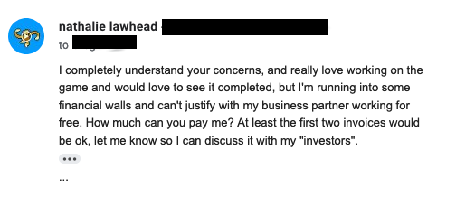
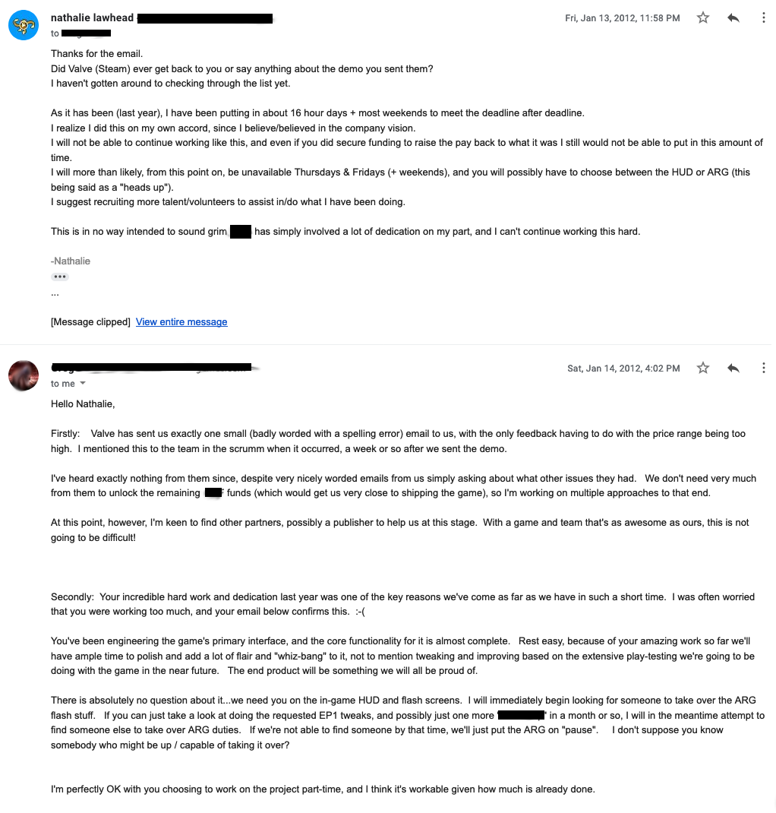
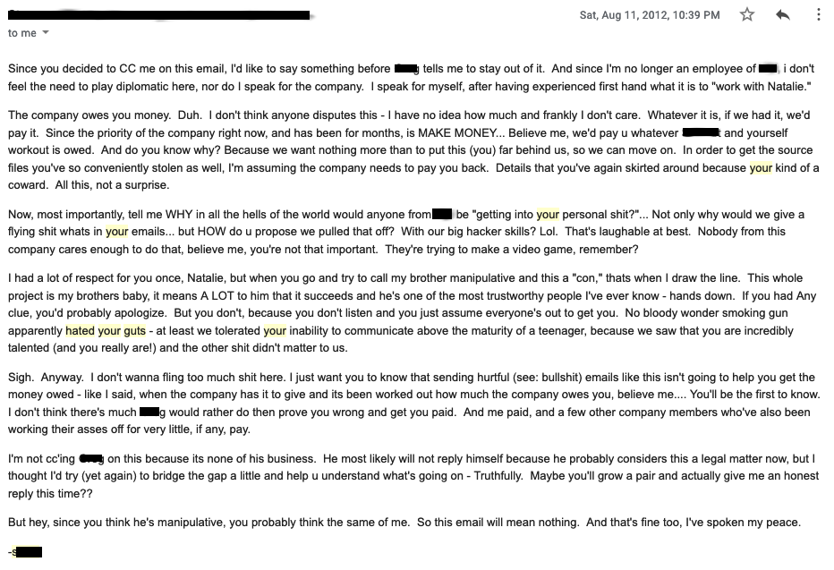

By nathalie | Published August 26, 2019

On November 4 2008 I was contacted by a studio in Vancouver to design and build an ARG for their new IP.
I talked about my experiences of working with this company before. For example, [in this post](https://gamejolt.com/@alienmelon/post/so-how-is-it-like-being-a-woman-in-tech-c6uzvwbd).

What I didn’t share, when talking about my experiences, is that I was raped by [Jeremy Soule](https://en.wikipedia.org/wiki/Jeremy_Soule) while I was working there.

I’m writing this post to honestly, and openly, explain what I have been through. I am sharing emails between myself and my bosses (and others that I worked with) to provide proof of the abuse that I went through. I don’t really care about what they’ll do to me, or the legal repercussions. It’s too hard to not say something (I can’t keep this up), and I hope me sharing will prevent other women from being victimized by him.

The 2008 Vancouver ARG job seemed like an exciting opportunity to “break into” the video game industry.
I desperately needed this job. I needed the resume item, the opportunities, everything about it seemed amazing.
This job was set to be my “big break”.
Jeremy knew this, and knew the situation that I was in, and took advantage of his position to do what he did to me.

During my stay in Canada, I was in the ER twice while working for this company. Once from overwork, the other was also exhaustion related. I went out of my way for this project, and sacrificed a lot for it.
For the record, I was in my mid (late) 20’s when this happened.

Every time I wanted to quit, the CEO of the company and my boss (I will refer to him as “the CEO” from now on) would talk me into renewing the contract. The project was extremely poorly managed with the directors (project leads) being unavailable when decisions had to be made, and when they were available they would throw out work and consistently decide to redo everything.
Even when close to the deadline they would throw work out, and have things constantly redone, while also fighting with each other over their “vision” of it.
There was a lot of ego from the leads.
I was very taken advantage of while working there.
I also got into trouble with immigration because they were trying to cut corners with my paperwork and VISA. I was in a very difficult, very desperate situation. I needed this job. I was hell bent on doing absolutely anything, and sacrificing what it takes, to make this ARG work.

The context is important because this is how Jeremy took advantage of me.

I first met Jeremy Soule at a company Christmas party while I was in Vancouver. We connected over being artists. I was excited about being in “the game industry”, and the fact that I connected with someone like him. He was a fellow artist. He had philosophies about art. It was exciting talking about creativity with him, and the love for it.
At this point in my contract with this company things were slowly going sideways because of poor management (on the part of the directors).
We hung out after the Christmas party and eventually a friendship formed.
He acted like he was going to help me. He was something of a mentor in terms of learning the ropes of this industry (at the time it came off as that). He offered a lot of advice, and offered a lot of help.
We talked often, and I shared my frustrations and desperation about my situation with him. He knew what I was going through, and how desperately I needed this job to work out. He also knew what my VISA situation was like. He pretty much knew everything about me. I shared a lot with him because I thought he was a friend.

We started hanging out on weekends. I didn’t consider this dating because I was very clear with him that the friendship meant too much to me. I didn’t want a relationship. I wanted a friendship.
I never reached out to him, or went after him myself. Any contact with him happened because he would come up with a project that he needed help with and wanted to talk about it over dinner or while hanging out. I was naive and trusted that this was a friendship.

Most of the conversations between me and him involved him complaining about the women that wronged him. At the time I thought he was in serious pain, and that he needed a friend to talk too. Now I realize that this was predatory behavior.
The longer I hung out with him, the worst these conversations got.
He shared about how women cheated on him. He talked about one woman for who he paid for life saving medical treatment, but she rejected him even “after all his help”. He then went on to talk about another woman that he was dating, who had a very young daughter, and he found out that she was being molested. The way he described this was awful and graphic… the more I listened the darker it got, and at this point it sounded more like he did things to these women instead of the other way around.

Eventually he started to indirectly threaten my position at work, saying things like “It’s me or bust.” Jeremy was close friends with the CEO, and the CEO (my boss) would speak highly of him.
I was afraid of losing my job, and he knew how desperate I was because I shared with him that I didn’t know what I would do if this didn’t work out. I didn’t want to jeopardize this job so I was afraid of rejecting him and tried to keep the friendship.
As things went on, he started to become more misogynistic and sexist.
He talked about the mystical power women hold over men with sex. How men are helpless and they need sex. How he needs sex, and a relationship, so he can write his music.
He talked about how composing is sexual, and how he will write about sex as inspiration in his music. He talked about how performing music is very sexual. He wrote songs about women that he had relationships with this way. What he does to women, is what inspires his music.
The work he composed for video games is based on this. He “needs women to inspire him”… there was so much of this, very uncomfortable inappropriate stuff (inappropriate even for friends), and it kept getting darker and darker.
He made advances on me and I explained that I didn’t want this and wanted a friendship. He was very threatening, and didn’t listen. He made it clear that it’s “him or bust”.
He raped me.
Throughout this time Jeremy acted like a victim, and blamed women he was in relationships with (or forced relationships on) for what he was doing.

I didn’t get myself checked out after it happened. I didn’t even know what to do.
I was in a foreign country (Vancouver), and didn’t have any friends. I didn’t know anyone and couldn’t reach out for help. I was afraid of consequences because of my VISA situation. The company was seriously not being honest with their work permit paperwork, and I wasn’t fully aware of this until it was too late.

I didn’t take a sick day or leave of absence or anything. I went back to work. I buried myself in work. I went in to the office on weekends. I worked from “home” (the apartment in Vancouver that I was staying). I needed this ARG to work out. I even got my sister involved, and asked her to work on it to help with motion graphics work.
I kept renewing the contract, even if I knew this wasn’t going to work out. The CEO would talk me into staying, despite knowing how fucked up the situation was.

During one of the medical emergencies my mom even came to Vancouver to nurse me back to health (I didn’t have health insurance, and didn’t know anybody in the city that could help me recover). It was a pretty serious emergency too. I rested on the weekend, and I went back to work on Monday, even though I could barely walk to the office.
To the people I worked with, I hid the worst of what was happening to me.
Jeremy visited the office (even though he usually doesn’t do that). We kept hanging out, afterwards. I hung out because I was afraid of the consequences of rejecting him. I got drunk a lot at this point to make it easier.
He even met my mom. The consequences had been made clear.

I was mortified of what would happen if this exploded and cost me this job. I was afraid. I tried very hard to ignore what happened and just keep going. I would go to the bathroom during work hours to cry, pull myself back together, and just keep working on this trashfire of an ARG that bad management (on the part of the directors) was killing.
It was very clear what would happen if I reject him, so I thought I could avoid him.

I went back home (to California) for a couple of weeks, and that’s when he asked me to make a website for him and another J-Pop musician that he was working with. I couldn’t say no because he’s friends with literally everyone. He had made the authority that he holds clear.
I made the website for him. What could have been an afternoon’s worth of work was drug out almost a week or more with changes after changes after changes… He kept coming up with stupid things to change. I crunched to get it done.
He told me to just bill him. I sent him the invoice and didn’t get an answer.
After 30 days of being ghosted, I followed up.

I was incredibly fed up and tired of being scared. I know I shouldn’t have stood up for myself (I suspect this is partly responsible for costing me my job), but I did. I think this was a turning point.
I wrote a poorly worded passive aggressive email and CC’d his business partner in on it, AND the musician that he was working with for whom this website was partly for. I don’t think the other musician knew that I wasn’t being paid.

The J-Pop musician answered right away and sincerely apologized. He offered to pay me out of his own pocket. No questions asked. He didn’t even care about proof. I remember being really touched by this, and cried when I read that email.

Jeremy’s brother got involved then, and they paid me.

At this point things started to really go sideways with the ARG. The directors kept throwing work out and changing direction. A deadline was approaching and they kept scrapping work and issuing re-iterations. I was exhausted.

Shortly before being fired, the CEO talked me into renewing the contract. I vividly remember the CEO basically begging me not to quit on them. He acknowledged that I had two ambulance rides to the ER while working there, and how much I sacrificed to be there, and the trouble I had with immigration because of how poorly managed the VISA situation was on their part. He told me it would get better, and that this would all be worth it. He told me that I “am the ARG” and without me there would be no ARG. It was very important to them that I don’t quit…
I renewed the contract.

Shortly before launch the CEO fired me for “not putting my best foot forward”. I was accused of bad management and having endangered the company because I supposedly promised to do something that I couldn’t do. This was a lie, and they knew what the problem was since I kept telling them that they can’t keep changing things.

I COULD do it. I was doing it. I did an incredible job despite them, and I’m surprised anything gets done at that studio.
They told me they didn’t want to pay me the final invoice because the ARG was a failure (they never paid the last amount and still owe me).
I was not credited, and any involvement I had was completely erased.
I was locked out of the email account that I was using, without any notice, so I don’t have proof of things said or promised by the CEO.

(my last work related email with them)

(the CEO’s answer)

After launch the ARG received a lot of critical acclaim and even got covered by the Guardian. It was on Boing Boing. It was at SXSW. Pretty much everywhere.
I followed up with them saying that it was actually NOT a failure, and the acclaim my work was getting should prove that (I called it “my work” because the CEO kept telling me that I “am the ARG” while I worked there).

The CEO insisted that I didn’t put my best foot forward, and that they where right to treat me this way.
It ended very badly. Part of me suspects that Jeremy had some hand to play in it. He was friends with the CEO.

The CEO’s response to me (I wanted to get paid):

From me to the CEO:

From the CEO to me:

I invite you, at this point, [to look at the breadth of work](https://alienmelon.itch.io/) that [I have put out since](http://tetrageddon.com/) (on my own, without help) [and see how capable I am of creating very large very involved experiences](http://unicornycopia.com/) (on my own). I could have done this, and made every effort to make this work for them. The only reason they had an ARG was because of me, and I say that with absolute confidence.

Post-launch was a very difficult time for me. I worked 2+ years on something that I was completely erased from, and shamed out of. They didn’t even want to pay the last invoice (although they are contractually obligated to do so).
I was blamed for jeopardizing the future of a company that I sacrificed health, body, sanity, family, and personal comfort for.
I was emotionally used, creatively used, and professionally used. It was very hard to pick myself up after that.

Jeremy would occasionally text or email me out of the blue. My answers to him stayed superficially friendly because I was hoping to salvage the situation (he knew everyone that I had contact with). At one point he texted me from a wedding of one of his friends.
This friend would be my next boss, and I’ll be referring to this person as “My Boss” from now on…
It was humiliating.

I was contacted over LinkedIn by a co-worker (My Boss) that I met at the first Vancouver company. We met because he was also sitting at the same table during the Christmas party where I met Jeremy.
This co-worker told me that he wanted to make an ARG for an upcoming FPS that he was making. He was seeking funding for it from the Vancouver government (Vancouver has a fund for work like this), and having an ARG would help promote it.

I saw this as my chance to prove the first company wrong and show that I could make a thing. It was my redemption as well as my second chance. I was hell bent on making this one work.

Unfortunately Jeremy was also very close friends with this person (My Boss). I don’t know what I was thinking but I promised myself that he will not push me out of this one. No matter what, I had to succeed. I needed this job.

Around 2010 I built the first episode of the ARG for this new company. I worked weeks often till 5AM. I would not sleep. I napped by my computer. If My Boss and his brother had an idea I would do it, no questions asked. I worked with the promise of money. They where not paying me yet.
Things kept going, and I was running into serious financial issues because of the unpaid work, unpaid overtime, and not being paid.
I told them that I had to step back from the project, and if they wanted to keep working with me they need to get funding.

My Boss tried to talk me into more work and said that he was planning on stopping when they owed me $10k. At the time they owed me more than $7,000.
My Boss gave me his word that he would pay me. He underlined that he gives me his word. Come what may, he will do what he can to reimburse me for this first ARG bill… He would take out a lone. He would pay from his own pocket… He really made it clear that I have his word.

At this point I would also like to point out that I was generously rounding down, and not billing. I didn’t bill for the overtime, and only billed for 8 hour work days. I was working phenomenally longer hours than that.
I didn’t bill them overtime because I really needed this job, stupidly believed in what they were making, and didn’t want to inconvenience them by costing them too much.
The contract with them had a maximum amount of hours to pay for. Once I exceeded the maximum, I would keep working.

After an exchange in which My Boss tried to talk me into working more…

(email exchange between me and My Boss)

I stopped, and went back to recovering. The crunch was very hard on me physically. My Boss knew how hard I was working, and acknowledged that.

Toward the end of the year they got funding for their project (from a Vancouver art fund). I thought it would work. Jeremy was going to be a composer for this game, and that was where things went to hell.

I visited Vancouver for their company launch party. I got to meet the team. They seemed like reasonable people. I was the only woman working there (other than My Boss’s wife).
Jeremy showed up once, shook everyone’s had, shook mine, and left. I didn’t know what to say. I was afraid. I tried to keep my distance and participate. I worked extremely hard even while visiting, and before the company launch. My Boss kept coming up with things to change, do, make, and so on…

I was probably the first person on the team to start crunching long before crunch was even necessary. I did everything I could to show that I was on board and dedicated.

My working situation with them eventually degraded. When I started working there, they where nice to me, and overall kind about my involvement.
I’m not sure what was going on because I was working remotely, but I know that Jeremy was involved in turning things against me. They seriously changed how they treated me. It was painfully clear and the conduct was just horrible.

At one point that I visited Vancouver, and Jeremy was talking to two other co-workers, he was talking about how the company should get me to stay in Vancouver (instead of California where I live). He was talking shit about my mom, and the environment I’m in (I’m not in a bad environment. My mom is extremely supportive), and how I should go to Vancouver. I “can stay at his place”…
He was trying to convince them that I should stay with him.
This was all within earshot, and I was right there in the room.
What Jeremy was doing was more often than not so obvious, so inappropriate, happening right there in front of everyone, and nobody did anything. My Boss knew. It didn’t even need to be brought up. That behavior was clearly inappropriate.
It was a steady stream of dumb stuff like that, that I had to tip toe around.

As time went on, I was steadily treated more and more like absolute trash. The lead writer of the ARG (My Boss’s brother) went so far as to write me in (by quoting what I said at the party) for the “bad guys” in the game. It was so humiliating. My Boss’s brother kept doing stuff like that.
I would crunch overnight to make a feature for them. When I got the writing from him, there was something blatantly humiliating about me that I should put into what I was making for them. It kept happening.

I was often berated during the remote Skype calls.
I worked overtime. Constantly. I slept at my desk. I needed this job. I thought if I work hard enough I could prove whatever Jeremy was saying about me was wrong, and make this work.

I built their ARG AND their corporate company website (HTML, CSS, custom WordPress theme and install). Any online presence they had came from me. I even kept customizing their internal company forum (php).
(I should also point out now that it has degraded since I left. My work isn’t buggy.)
I built so much of their online presence in all sorts of different technologies. I say this because it should be clear that the technical work done for them was amazing and they’d be hard pressed to find anyone else like that. I’m not “dumb” like I was made out to be.

During one Skype meeting, colleagues spent what felt like 10 minutes reaming into something I did for the ARG, talking about how dumb it was and how poorly designed it was, using borderline abusive language. They never talked about each other’s work like this. Not EVER.
This was treatment that only I would get. My Boss did nothing to stop this, and it had to be one other colleague (the only one that was nice to me while I worked there) that broke it off and told them that’s enough.
This was how I was treated, as a normal thing.

I did everything right. I didn’t speak unless I was spoken to. I didn’t offer anything personal. I followed through on every stupid little request, fix, bug, feature request, overhaul, addition, that My Boss and his brother came up with. If they asked for something, I worked overnight to make it happen.
No matter how hard I worked, it would go nowhere. I kept getting treated like trash. My Boss kept promising me things, to keep me working.

I would tell My Boss how hard I worked, he acknowledged it and promised things he had no intention of delivering on (he never followed through). He told me that they would never forget this. That they appreciated it. That it was critical. That they needed it… and the work kept piling up.
I couldn’t take breaks because they kept needing emergency stuff to get fixed.
Since I used my personal email, I still have ALL those conversations.

At one point I SVN’d all my ARG work into the repository. It was a few gigabytes. The next day, during the daily Skype call, the team bitched and moaned that I shouldn’t upload such large files. It was relentless. So I stopped uploading ARG work to the SVN.
Things like this were constant. I couldn’t do anything right.

My Boss kept promising things, but didn’t deliver on any of it. Every time I brought up how hard I worked, he would apologize but do nothing to amend that. If I needed a break, something urgent would always come up. The cycle of work would continue.
Nobody else worked this hard.
I remember during Halloween seeing the team take off for parties and thinking that it wasn’t fair that I wasn’t allowed to take off. When I did I would get passive aggressive crap from My Boss’s brother (the lead writer). It became normal.

(from My Boss to me)

Toward the end of the year, the constant crunch was taking a toll on my body. They had also lowered my hourly rate. I thought I could still keep it up, but things where not going anywhere and I kept being asked for too much.

I couldn’t physically handle it. I had irregular heartbeat, couldn’t sleep, couldn’t really digest food anymore (since I skipped so many meals to be able to be there for them).
I had to quit.

(email exchange between me and My Boss)

I emailed My Boss completely breaking off my involvement. Also worth mentioning is that, when we signed the contract, I insisted on having a clause in it that said that I can quit anytime without notice. My Boss agreed to that.

I physically crashed for a month. I was bedridden. I didn’t have health insurance so I fought through some serious health issues. I wasn’t available, or at my computer, during that period. I literally spent a month in bed unable to move (my mom was there for that and she can confirm, since she nursed me back to health).

When I recovered, I noticed the first ARG bill (the one that My Boss gave me his word that he would pay) wasn’t being paid while I was working there.
They had a lot of excuses for this.
One was that they weren’t getting invoices, but they already had the invoice. My Boss should have been paying that. There was no reason for me to invoice them again on top of the old invoices.

When I followed up I wasn’t getting an answer.

During that same time someone was hacking into my email accounts. Given how poorly I was treated there, and how completely abusive some of the treatment was, I had good reason to suspect them. The IP was coming from Canada, so I wrote a confrontational e-mail to My Boss. I really didn’t care about being tactful at this point. I was too tired.

In retrospect that could have been worded better, but given all that I had been through I didn’t care about diplomacy. They were ignoring my invoice, and he broke his promise to pay me for the original work done on the ARG.

This was the answer from My Boss’s brother (the lead writer). I CC’d him in on it since him and My Boss where the first people that I originally worked with (before there even was a “core team”).

This email highlights exactly how I was treated while I was there. The language. Everything.

I worked to a point that I nearly killed myself. I kept my head down. I was nice no matter how abusive they where. I laughed at derogatory jokes. I laughed at jokes when they made fun of how I talked. I laughed when My Boss joked about how one of his friends said “A girl did that?? A girl did that??” (when told that I was behind the ARG). I swallowed everything.
This was normal.

Their accountant answered. They accused me of stealing the ARG source files (because not everything was SVN’d in).
Keep in mind that I only got one email from My Boss asking me to upload them to the SVN, and to be honest I was too sick to do it immediately. They didn’t follow up either, so I missed that.
In the past, the entire team also complained when I uploaded work to the SVN.
They didn’t want to pay, and they threatened legal action.
This is some of the email thread. I’m omitting a lot of my “hey did you have time to look at this” follow ups. I really had to hound them to get them to follow through…

(Email exchange between their accountant and myself. My Boss was CC’d in on all this…)

I will also acknowledge that during this time one of my therapy writing exercises was sent to Jeremy. Not on purpose, but I don’t apologize for it. I was fighting with trying to pick myself up again, get paid, and move on.

Eventually they did pay some of it. They still owe me money (for the part of the project that My Boss “gave me his word” that he would pay). It’s one of the most abusive, manipulative, and horrible work situations I ever endured.

This last email of me asking about the 2k was never answered.

After getting paid for what they felt like paying me, we parted ways. I never looked back.

I eventually got an email from My Boss apologizing and hoping that we can put this behind us or whatever. I ignored it. Over time, I got a couple more LinkedIn messages from him apologizing. I ignored those. I got a couple LinkedIn invites from him asking me to re-add him to my network. I ignored those… eventually I stopped hearing from them.

After this experience, I was physically and emotionally broken. It took a lot of courage to even be able to play video games again. I couldn’t look at Gamasutra. I felt sick whenever I heard the phrase “video game”.
I thought that the entire game industry was like this and I couldn’t handle thinking about all those women, and artists, that might have gone through the same. I believed that this was normal.

I was seriously considering suicide. I had tried once and failed.
I realize what it means to admit this, and talk about my mental state. You can say that I was “sick in the head”, and they where well in their right to do this.
I was never “sick in the head”. EVER. What made me sick was being raped, and treated like expendable trash. What made me sick was that my work was good enough to take, but I wasn’t good enough to pay or credit.

I wanted to die. It was impossible to live with what was done.

I decided that if I can make two ARG’s for two assholes, then I can do the same thing for myself. I need to at least try one more time. My work is good. No matter how disgusting, useless, inhuman, horrible of a person I am, at least my work is good.

I picked up [Tetrageddon](http://tetrageddon.com/) again.
[Tetrageddon](https://alienmelon.itch.io/tetrageddon) was the project that I was working on before the first Vancouver company contacted me.

It was literally impossible to power through the early development of it. I had regular breakdowns at my computer, bawling my eyes out while I was coding.

At one point I was listening to the classical music radio station on Pandora radio, and Jeremy’s music started playing. I had such a melt down. It was indescribably painful. It’s something I vividly remember. He’s having his music played on the radio, and I’m here picking myself up a third time. How can someone so selfish just thrive?

What made this hard for me was that I used to be a fan of Morrowind. I loved that game. It was one of my favorite games. When Skyrim came out I couldn’t play it, knowing where his music came from.
He makes songs about sex. It’s about what he does to women. To him it’s some sick twisted old-school romanticization of women as muses. To me, that type of boy-genius is something I view as incredibly destructive. That type of manbaby genius can do whatever he wants, harm whoever he likes, walk over whoever he wants, all in the interest of making “brilliant” work, and people will defend him for it.
Jeremy told me where the inspiration for his music comes from. It was broken down in graphic detail by him. Skyrim came out after what he did to me. Part of me wonders how much of me is in that music too… I can’t listen to it. I can’t play these games anymore.
When Bethesda announces anything at E3 it’s a personal nightmare because his music is part of it and I can’t tune it out.
He can’t bullshit about that. He talked so much about his music being about sex and women (women that, to my knowledge, he hurt).

Despite crying pretty much everyday (some days I cried most of the day), I powered through early development of Tetrageddon. I have no idea how I managed.
I went on a submission spree and spent most of my money submitting it to events or things. Pretty much anything that had a “submit” button I would submit to.
Even if I believed that anything about me or that I made was total trash, and I’m the last shit on earth, I did it anyway. I had to try. I can always die later.

Tetrageddon eventually made it into Communication Arts. That was one of my first big breaks after the abuse.
I remember being so paranoid that Communication Arts would realize that I don’t belong, that I bought two copies of the magazine just to make sure that I was still in there, or if they removed me.
I know now that that’s not how printing works, but then I was terrified that people would find out that my work is horrible.

The first video game place that picked Tetrageddon up was IndieCade. They wanted it in their E3 selection.
I remember how it was like when I got their email. I was speechless. In disbelief. I thought at any moment they would realize they made a mistake by wanting me there and I would get the rejection letter.
I think that IndieCade showcase marks the point where I stopped wanting to kill myself. I’m not sure what happened, but that’s when I entered some sort of alternate reality where I became human again.
E3 was the pinnacle of places any of those guys wanted their work to show.
I was mortified of going because of my experiences with men. I expected to be treated like this again.

The opposite happened. It was a welcoming community. Volunteers actually volunteered to help me. They greeted me.
Men came to my area of the booth and enjoyed my work, and even went so far as to compliment it.
I know how it sounds to phrase things like that, but at the time I didn’t think men could do that. I didn’t think women were something you would even give that time of day. I was so broken.
Tetrageddon got a lot of press during that E3. It’s like what I had been through was slowly being undone.

Offender 2 (the game that I was working on when I was breaking down the most, and felt like absolute agony to finish) got into Fantastic Arcade. They let me give a talk. As if I had things worth saying. I was human.
I know that I am, but I really didn’t feel like I was a person after all this.
Journalists talked about me like I’m actually a person. Like the fact that I made this work wasn’t something to be ashamed of. They didn’t strip me of my identity when approaching my work. They included it.
Tetrageddon went as far as to win the IGF Nuovo award.

What stings so much about how my former boss talks about me now is that he actually brags. He made a point to brag about my involvement in a post-mortem Gamasutra blogpost (apparently not up anymore). I ran into him at GDC and he cheerfully greeted me with “Nathalie! Do you remember me?” like somehow what they did, and how they behaved is OK. I don’t want to see these people ever again. It’s not OK.

I sincerely mean this, and I don’t say this lightly, but if it wasn’t for IndieCade I don’t think I would be here today.
If it wasn’t for what I experienced in the indie space, I would have killed myself. I honestly believed that men were just like this, and that there wasn’t any space for me. I don’t think there’s words to express how trapped, hopeless, and alone you feel when you realize that no matter how hard you work, you’ll never get anywhere because you are not a man. A guy can do this to you. Rape you. Harass you. Cost you everything, and people will believe the wildest things he says about you because he is who he is and you are nothing.

It took me years to come to a point where I could even talk about it. I gradually worked up the courage to say something and [posted about it on my blog](http://www.nathalielawhead.com/candybox/the-hold-in-there-mentality-post-e3-some-thoughts-about-indie-and-mainstream-culture).
My mom found out, about a year after that post, when I was drunk and didn’t have the inhibition to not talk about it. I couldn’t tell her, I had to read the post to her because saying it out loud was too hard.
This should go to show how hard it is to overcome something like this. I share EVERYTHING with my mom. I couldn’t tell her this.

Most victims don’t survive this. They burn out. They leave the industry. They commit suicide, develop eating disorders, self-hate to a point that you can’t even function. I’m lucky that I have a family that picked me up when I was beyond broken. I’m lucky that I had the strength to not completely believe what I believed about myself, and try again. I’m lucky to get to a point where I can speak up.

When you defend rapists, and bemoan the cultural loss of their work when they get called out, think about the bigger loss that could have been the contributions of their victims. I have things to contribute too. I have art to put out there too. I matter too. Other victims do too.

I realize that the indie space is not without fault. I often get messages from women warning me about someone. It’s disgusting what “important people” will do to people they know can’t fight back.
Either way, I was given a chance to succeed despite all that.
This space is better for all the people fighting to keep it that way, and make it better.

I realize the consequences involved in sharing this. I know what happens when AAA fandoms go after someone, but I can’t survive not talking about it. Living with this is like a slow death. I’m suffocating.
I hate how we talk about rapists. I hate how we defend them. I hate how you can share all this, and slowly watch as your sanity gets questioned, and everything about you gets picked apart until “did it actually happen to you?” “did you want it?”…

Jeremy said a lot of things about me, to make sure I don’t stand a chance. He controlled my success. He controlled how people view me (both positively and then negatively).
He’s good at making people think that he was actually helping, and that you are out of your mind. I worked very hard on proving all this wrong and coming to a point where I could say something and it stands a chance of being heard.

I don’t want to confront this. I don’t want to fight this. I want this to never have happened.

I don’t expect to be able to show my face or be welcomed in this space after posting this, but I can’t stand thinking about the others he might victimize if he goes unchallenged.
I share this with the paranoia that all my friends, and places that supported my games, will side with him. I’m mortified of that. I also know that it will be very hard for me to show my face at any indie event after this.

I share not expecting to be able to get through the backlash, the lying, the excuses, the gaslighting happening all over again, the fanbase that might come after me because that’s just what happens in games, or hearing more of “his side of the story”.
My side of the story was never given a chance.
I’m willing to try.

I’m sharing this hoping that there will be information about him out there so other women can be informed.
He took advantage of an eager naive new girl that want to “break in” by offering a lot of help, and acting like he will mentor me, and then forcing me into a position where I was taken advantage of by him. He is extremely manipulative and will blame you for what he does to you.

I am deeply grateful to all those that believed in my work. It has helped me heal. Please know that no matter what happens I appreciate the kind words, friendship, and love that has been given to me. I wouldn’t have made it this far without it.
Most victims of this don’t survive. They don’t enjoy the privilege of seeing the light of day the way I have. When someone like this does this to you it is irreparable on every level.
