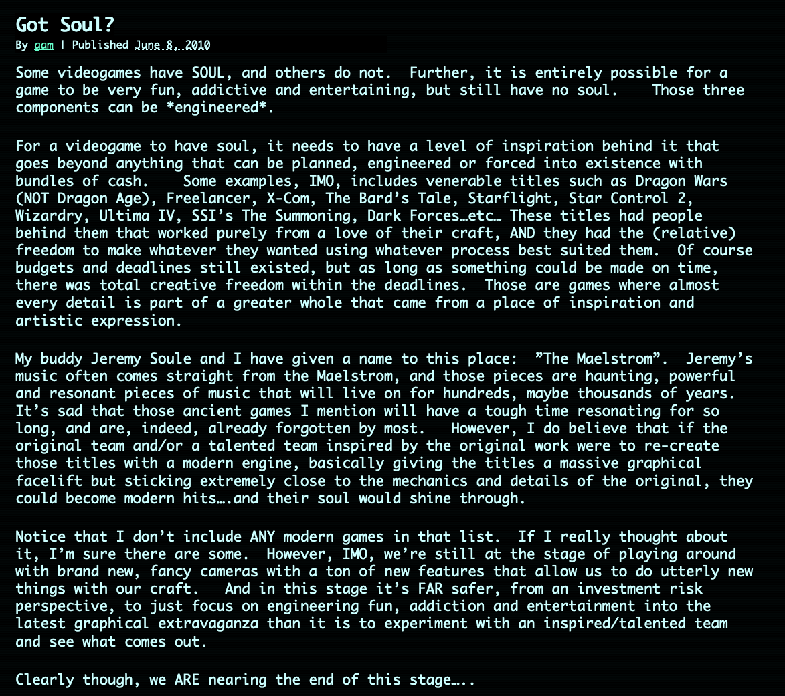

`the following is cross posted with consent from Nathalie Lawhead's blog in order to support her`

To start off, I would like to thank all my friends, and supporters, who have reached out to me. I’m also sorry that I’ve been very bad at answering texts, emails, and DM’s. I’ve been trying to stay off social media and lay low.
Thank you all for your support. As you can imagine I didn’t expect this.

[In a recent Twitter thread](https://twitter.com/alienmelon/status/1168239687254691841?s=20) I said that I would do a follow up post hopefully clearing the air and dealing with some of the misconceptions, or less welcoming theories about my intentions, that have been coming my way.

Before you go on reading this, commenting, or sharing your opinion, please have the courtesy to read through my whole post (in its entirety): [http://www.nathalielawhead.com/candybox/calling-out](http://www.nathalielawhead.com/candybox/calling-out)

I can’t really think of anything to add to it since I feel like it said everything that could possibly be said. So please read it.

After doing so, please read the Kotaku article about my experience. Be warned that it is triggering, and goes into detail. Not that you need to know detail, but it’s out there: [https://kotaku.com/two-women-accuse-skyrim-composer-jeremy-soule-of-sexual-1837677315](https://kotaku.com/two-women-accuse-skyrim-composer-jeremy-soule-of-sexual-1837677315)
Please understand the type of person that you are defending.
Since posting this others have come forward. It’s discreet right now, but I hope to god that it turns into something. I want, more than anything, accountability for what was done to me and others.

Also, yes, I realize that I made a mistake and said “country” instead of “city” when referring to Vancouver. I was crying too hard while proof reading. I’m not going to fix this. What I said stays the way I said it. You can extend the courtesy of listening to what is being said instead of nitpicking. Thank you.

A frequent question that gets brought up is “why now”. I would like people to understand that I tried. I spent years trying.
When I did try, closer to when it happened, I couldn’t even speak ill of him. I was completely shot down.
Every E3 I would post a thread talking about how hard it is to see him in the open, to be confronted with his work, and nobody knowing what happened. I talked extensively how you can’t do anything about this unless you are famous too, and matter to people.
I spent years building up a reputation, and standing in this community. I wanted to say something. I didn’t think I mattered enough to be believed. I put this in my work. The experience is in “[Everything is going to be OK](https://alienmelon.itch.io/everything-is-going-to-be-ok)“. You can play it and read the poetry. The emotional struggle is thoroughly documented. I worked very hard on building what I have, and promoting my work. I did all this fairly without EVER capitalizing on what I was put through. Don’t dare say that I’m doing this for attention or to draw attention to myself.
What I have was built fairly, outside of victimhood.
I prefer to be known for my work, not for what was done to me. I prefer to be on Kotaku because of my work, not because of this horror story. Don’t dare say that this is for headlines. The headlines these last few days have made me sick to my stomach.

If anything, this demonstrates the extent that survivors must go to be heard. My reality has been that you have to matter to people, you have to be socially valuable, you have to be culturally valuable, in order for something like this to be taken seriously.
The extend that you must go in order to be heard is not right.

So I don’t exactly understand what it takes. When a survivor comes forward what do you want? It’s too loud, it’s too quiet, it’s too direct, it’s too indirect… Will it ever be enough?
I [shared my account with Kotaku](https://kotaku.com/two-women-accuse-skyrim-composer-jeremy-soule-of-sexual-1837677315). Giving this interview was painful. It was hard not to cry. I didn’t even share everything that was done to me, and I’m grateful to the journalist for not investigating more line of questioning than necessary.
You need to understand that I spent YEARS trying to put this behind me and rebuild myself. After what he did it took the longest time to be able to sleep at night and not think about it when I wake up. I couldn’t look at myself in the mirror. It took a long time to rebuild.
I shared what I shared because it’s important to me that everyone knows what kind of person this is. I want him to never to hurt anyone again. You need to know what you are defending when you are defending abusive people.

You also cannot say that I’m doing this for money. I rejected Steam. I have my games exclusively on [itch.io](https://alienmelon.itch.io/) and [GameJolt](https://gamejolt.com/@alienmelon/games). They are literally ALL FREE. Whatever I make is through donations. I never capitalized on anything that happened to me. I worked hard on earning my place here.
To illustrate, here are my itch stats from when the post became widely spread:

I can make more, and get better attention by just releasing a game. If you feel inclined to argue, you can educate yourself first [by reading my itch.io stats blogpost here](http://www.nathalielawhead.com/candybox/my-gross-revenue-on-itch-io-transparently-sharing-all-my-stats-earnings-and-speaking-on-how-supportive-of-a-base-itch-io-has).
If I wanted to make money, I could put my work on Steam, and I would do better through that.
None of this is about money. The way I exist in this community was built fairly.

This is textbook “done right”. You have no place to invalidate this.
Which begs the question, what kind of behavior does our culture expect of survivors? Can you ever do it right? Can you please stop making this about us, and look at the abuser and just confront that? Can you please build a culture where abusers are de-platformed and safe rehabilitation is possible so abusers don’t cross a line that they cannot come back from?
It takes a village to enable an abuser. It takes a lot of blind eyes, and lack of confrontation, for them to come to a point where they can do what they do.
This sort of behavior isn’t born. It’s made. If you take someone that is already hurt, and has abusive tendencies, and then give them a platform where they “fall up” no mater what they do, you are helping them hurt others AS WELL AS themselves.
You need to confront them. You need to tell them that what they are doing is inappropriate and will not be rewarded. You can help them not turn into that. By ignoring all the red flags, you are enabling them.

Furthermore, you need to allow survivors to speak up so these stories are in the open and we can all heal. If we are too afraid of coming forward, and we are condemned for speaking up for fear that the abuser will harm themselves or react how they will react, or suffer personal or social consequences… then you risk losing us survivors too.
You have to STOP putting the burden on survivors. It’s not on us.
If we can’t protect ourselves from abusive and dangerous people and if our culture doesn’t have this space for confrontation AND healthy rehabilitation in ways that encourage better behavior, you will literally kill us too.
Suicidal ideation from being abused and walked over because of that is a very real thing.
[Read my post,](http://www.nathalielawhead.com/candybox/calling-out) see the frame of mind that I was in after I was denied payment and shamed from two jobs. If I killed myself, would anyone have cared?? Would anyone be accountable? What would the narrative be? Be realistic. I know the nicest comment would have leaned in the direction of “too bad, she had potential…”
You would never have heard my side of the story, and who I am today would have been lost to this person.
The situation we are in, when survivors carry the burden of calling out an abuser as well as managing the consequences of calling them out, is a constant cycle of “You’re damned if you do. You’re damned if you don’t.”

We desperately need a cultural and community shift.

A lot of this is in response to Alec’s reaction. I’m trying to not be very direct about using people’s names because I feel like this could have been anyone, and the issue is bigger than this.
I’m sorry if this is insensitive, and please understand my frame of mind right now as coming from my own personal experiences ([read my post](http://www.nathalielawhead.com/candybox/calling-out)), but all that I can think of when seeing the direction that this took is that men would rather die than work on themselves.

Everything about this, and all other cases that have come forward this last week, scream “too late”. It’s our own social shortcoming that is to blame.
It’s not on survivors for speaking up. It’s on our culture for allowing inappropriate behavior to happen, and allowing men to constantly “fall up” instead of confronting them.
I don’t see how a lot of the men here are given a chance to be better men. Being a horrible person is almost a joke and rewarded. Like it’s a silly character flaw that you attribute to being a genius or “misunderstood artist”. You put up with them because of what they bring to the table, so you’re willing to ignore a lot of bad things. Being a shitty person is not a character trait. You have to stop defending that because it keeps growing to a point where people get hurt (including the abuser).
You have to confront that. Men REALLY need to have long hard heart-to-heart conversations with each other about being better men. Men need to be there for each other, and reinforce better behavior.
It’s not on women to change men. Women can’t do this. By the time women are put in a situation where they’re required to “change a man” (make a man a better man through love, or whatever the tired romanticized stereotypes are) it’s already too late.

The sad thing about whisper networks is to hear the heartbreaking reality of the toll that abuse takes. Words cannot do justice to the emotional scars, suicidal ideation, and professional loss that happens when abusers are allowed to keep creating victims.
I get so many stories that are an outpouring of grief about how someone sexually and physically abused them, beat them, or professionally destroyed someone (sometimes just one of these things, sometimes all), and it’s beyond me how anyone can look at Metoo and blame that. You are losing us too. We matter too. Our social, cultural, and professional contributions mater too.
The conversations that happen when women discretely share information about someone, and it’s more often than not coupled with how it broke them, how they struggle with suicide, how they are getting help to be able to cope and function… none of this is right. We deserve to be safe. We deserve to be open about what was done to us. If you silence these conversations you keep change from happening.
This change can save abusive people from themselves and help them heal too. You need to understand the toll that silence is taking.

I will say this again to be absolutely clear…
Men need to hear these stories. They need to understand what is being enabled when they turn a blind eye, or jokingly enable creepy behavior as if it’s all just a silly misunderstanding and “that’s just how he is”.
Men need to care and educate men about being better men. This behavior needs to be regularly confronted. It needs to be identified and you need to have these serious talks. You cannot platform abusive men, and let them “fall up” anymore. You’re helping hurt them too.
If you educate and rehabilitate toxic behavior, you will prevent someone’s abusive behavior from becoming dangerous as well as saving them from crossing a line from which there is no coming back.

I view rape and physical abuse as a line too. I don’t think a person can continue to be here, in a position of cultural or social authority, if they have crossed that line. At that point they need to be held accountable for what they have done.
I’m sorry about how poorly I phrase this but: we need rehabilitation, not excommunication.
There should be consequence for abuse. These consequences, and the emotional burden, are not to be placed on the victim. An abusive person will react however they react when presented with the consequences of their actions and that is on THEM and not on anyone else.
Again, the failure is on part of our culture. I view abusers as victims of our culture because this is where they are created.

I realize that I’m kinda repeating myself, but because the last few days (and other reactions) have been largely spent on reassigning blame on the victims… I’ll illustrate to make this even more clear…

The reaction to my post from people that I worked with, and people that worked with Soule, makes me so angry.

I’ve gotten emails from people that worked with him, and saw other comments, basically saying things along the lines of:
“everyone that worked with him is not surprised”
“i was warned about this guy”
“similar accusations were made years ago”
“the two stories are not the only ones”
“i was warned about working with him…”
So there’s information on how difficult of a person he is, how he was predatory and creeped other women out, and how women were warning eachother.
It makes me angry because people KNEW, but both of my bosses gave me a massive sales job about how kind, sweet, selfless, and good of a person he is. They told me that he’s a great guy. I trusted him. There were no red flags until it was too late.

The second company that I talked about in my post says that Soule was only there in the capacity of composing, but that is such a lie.
He was friends with the boss, and my boss bragged about their friendship. There’s even this company blog post on archive where he calls him his buddy.

What’s even more insulting is that a coworker (the one I mentioned as the only one that was nice to me while I worked there) emailed me saying that he had no idea what was happening, and that he worked remotely so had no clue.
It’s so not true.
He was literally in the room, standing next to Soule, while Soule was trying to convince them to have me stay in Vancouver and that I should stay at his place. This coworker even Skyped me ON SITE, from Vancouver, for a large part of the extent that I worked there.
People KNEW of his behavior. It was happening in everyone’s face.

So now that I framed this, here is why this is so upsetting to me…

A blind eye was turned to grossly inappropriate predatory behavior. I wanted SO MUCH for someone to say “hey that’s not right, you can’t do that.”… “if you keep doing this we will have to let you go.”… Like just DO something.
They did nothing about it. It created a work environment that was so toxic for me that I nearly worked myself to death.
What’s worst is that they believed what he was saying about me. It impacted my standing there and the opportunities I would have had.

If someone is showing signs of abusive behavior, and being this creepy, why are you rewarding him? Why are you siding with him and not the person that he is preying on? Why are they allowed to control the narrative of the person that they are abusing?
If you could have stopped him, and confronted him, well before this became a pattern, maybe so many women would not have been hurt.
If I would have been taken seriously, and the work environment wasn’t so skewed to prefer abusiveness and exploitation, I’m sure this wouldn’t have happened to me. At least not to the severe extent that it did.

All this is our culture in a nutshell. By turning a blind eye to this type of behavior we are platforming abusers, and we are creating conditions in which they can hurt others as well as themselves.
Abusers needed help long before they started creating victims.

The only way to prevent this is to stop this behavior before it hurts someone.

My frame of mind these last few days, after hearing all the stories about Soule from people that worked with him, has been an avalanche of anger and generally feeling numb, like…
You all knew of his behavior? Nobody bothered to confront that before it turned into something dangerous? Men that could have confronted him didn’t? Don’t pat yourself on the back for the one bare minimum time that you did! Nobody believed me when I tried to say something? I had GROUNDS for what I was going through? It wasn’t just my fault? It wasn’t just me? The type of man he is was common knowledge?? Why didn’t anyone help me???
I payed for what was done to me to the fullest possible extent that someone can pay without losing their life. I wish I could put into words how much this has hurt, and how betrayed you end up feeling… [I made a game largely about it](https://alienmelon.itch.io/everything-is-going-to-be-ok). When is enough enough?

So this is pretty much all that I can add.

My closing thought…

If we survivors and potential victims can’t speak up and be safe, if the culture cannot build safety, rehabilitation, and have SERIOUS talks with men about being better men and working on themselves… You stand to lose us too.
We NEED a cultural shift.
